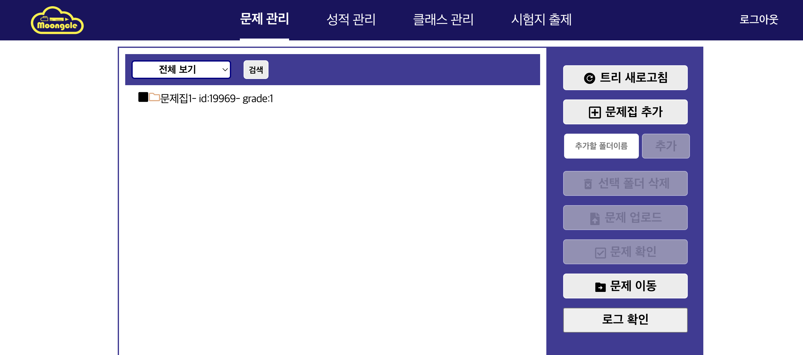
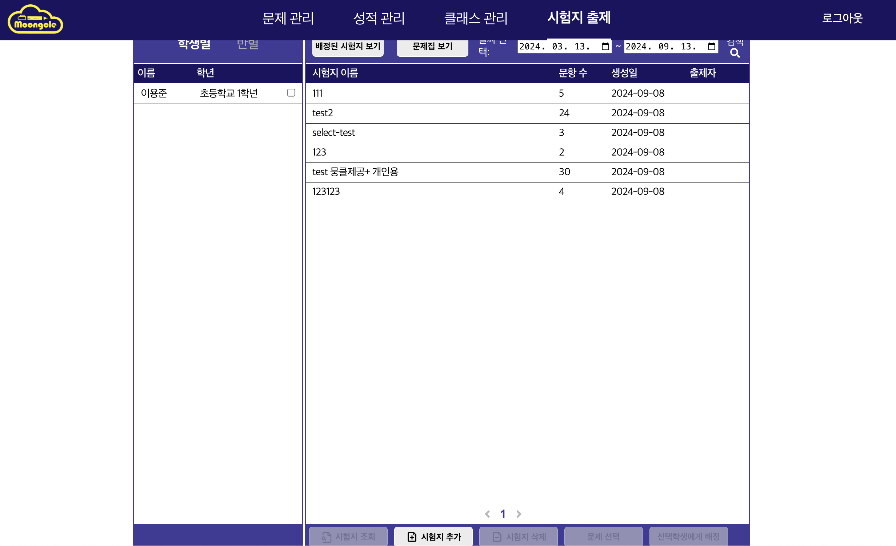
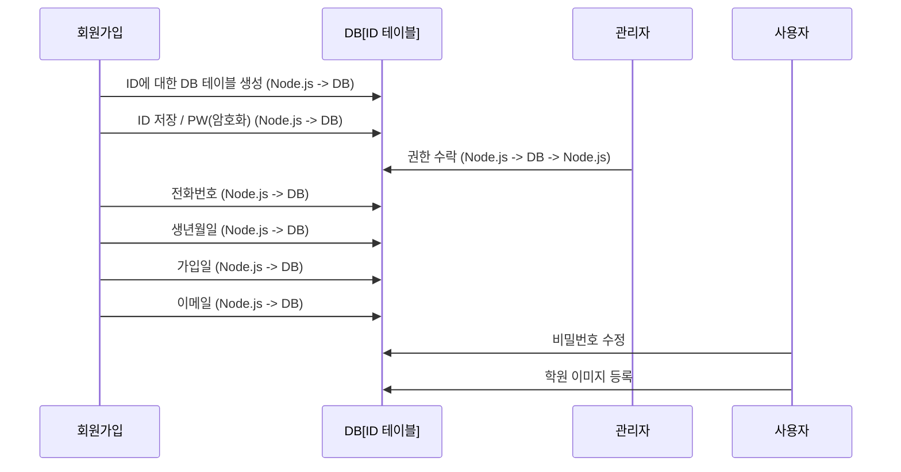
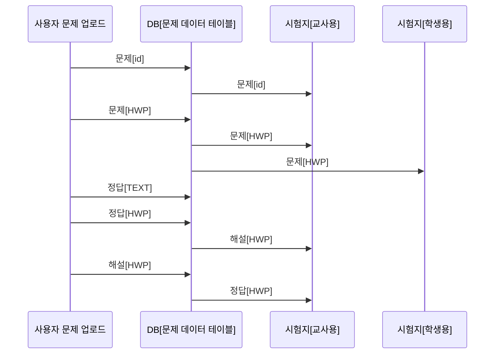
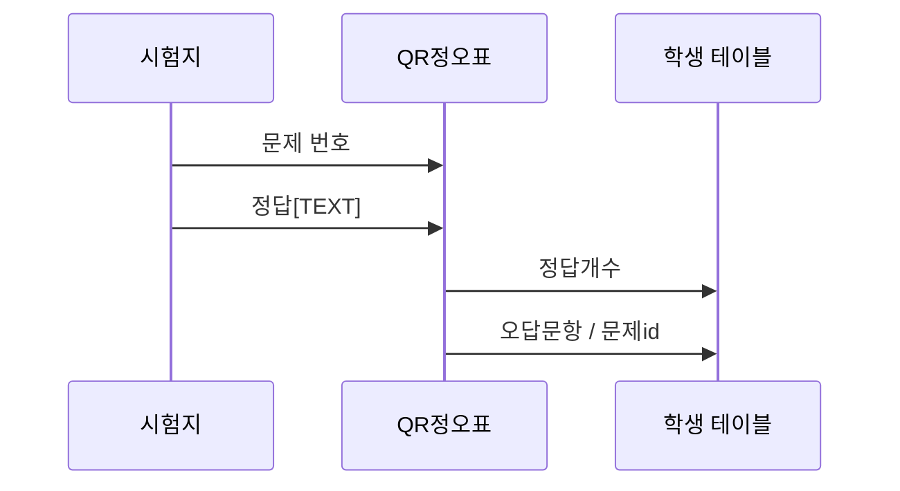

# Hangle-test-function-project

## 웹사이트 주소 : [뭉클](https://moongcle.xyz)

## 웹 사이트 정리
Server : Ubuntu 24.04 LTS
Frontend : ReactNative
Backend : Node.js (pm2)

## 데이터베이스 서버 정리
Server : Ubuntu 24.04
Database : DB (가용 램 10GB)

## 백업 설정
제품 : Synology 220j

## 클라이언트 쪽 미들웨어 프로그램
Backend : Django 5.0
Language : Python 3.12
Framework : pywin32, pillow, pyhwpx
### 문제 업로드 기능과 미들웨어 프로그램 결합 

### 시험지 조회 기능과 미들웨어 프로그램 결합

### 출제 유형 3번 문제 선택기능과 미들웨어 프로그램 결합

파이썬 프로그램으로 url 주소를 받아
win32를 통해 한글 프로그램을 컨트롤하여 데이터를 생성 및 DB에 업로드를 진행
이후 [시험지 생성 / 문제집 생성] 기능을 통해 생성된 데이터를 활용하여 시험지를 제작

## 주요 사이트 내부 작업 시퀀스 다이어그램 정리
### 회원가입 과정

### 문제 데이터 생성 및 시험지 출제

### 시험지-QR정오표-학생성적표 결과

## 느낀점
첫 공동으로 진행하는 프로젝트에서 클라이언트와 소통이 상당히 어려울 수 있다는 점을 많이 느꼈다.  
서버의 구성, 사용할 언어, 문제 상황 생성, 구조 설정 등  
다양한 문제가 있었고 팀원과 잘 협의하여 만들며  
다음 오류와 다음으로 성능을 개선해야할 부분 등  
작은 문제(단순 오류, 성능 개선)부터 큰 오류(시스템 다운, 소통 마비, 교착 지점 발생 등)을 작게나마 경험할 수 있었던 프로젝트였다.